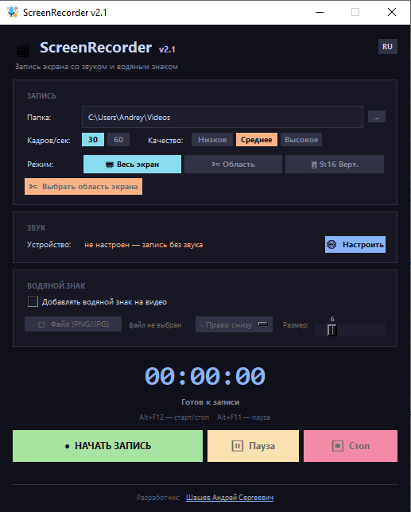
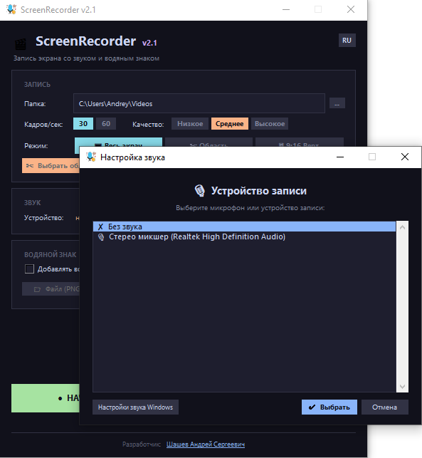
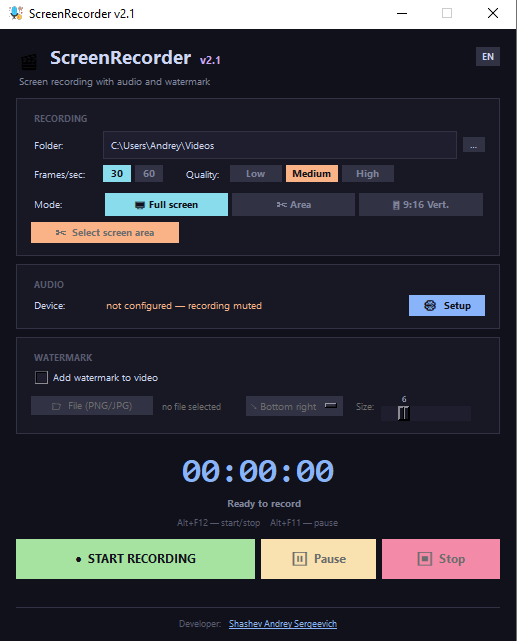
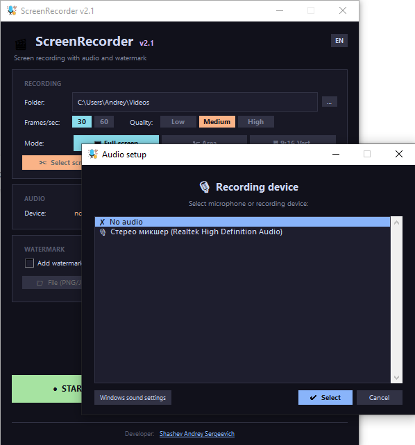

# 🎥 ScreenRecorder-SP v2.1

**[Русский](#русский)** | **[English](#english)**

---

## 🖥️ Скриншоты / Screenshots

**Общий вид (RU) / Main view (RU)**

**Настройка звука (RU) / Audio setup (RU)**

**Общий вид (EN) / Main view (EN)**

**Настройка звука (EN) / Audio setup (EN)**

---

## Русский

Быстрый и понятный инструмент для записи экрана — для Shorts, обучающих роликов и демонстрации программ.

Ищете удобную программу для записи видео с экрана компьютера? **ScreenRecorder-SP** — это лёгкое приложение для Windows, которое записывает рабочий стол без сложных настроек: запустил → нажал запись → готово.

### 🌍 Два языка интерфейса

- 🇷🇺 Русский
- 🇺🇸 English

Мгновенное переключение языка прямо в программе, без перезапуска.

**Системные требования:** Windows 10, 11

### ✅ Возможности

- Запись всего экрана
- Выбор произвольной области записи
- Вертикальная съёмка 9:16 для Shorts / Reels / TikTok
- Добавление водяного знака (PNG/JPG) с настройкой позиции и размера
- Запись со звуком (выбор устройства записи)
- Высокое качество записи (настраиваемый FPS и качество: низкое/среднее/высокое)
- Простое управление, подходит даже новичкам

### 🎬 Идеально для

- YouTube Shorts
- TikTok и Reels
- Обучающих видео
- Записи игр и программ
- Демонстрации экрана
- Создания контента для соцсетей

### 💰 Коммерческий продукт

Данный репозиторий носит презентационный характер — исходный код закрыт, программа распространяется на коммерческой основе.

Приобрести программу:

- 🌐 Сайт: [shashevpro.ru](https://shashevpro.ru)
- 🛒 Kwork: [kwork.ru/user/shashevpro](https://kwork.ru/user/shashevpro)
- ✉️ Email: programmer@shashevpro.ru
- 💬 VK: [vk.com/shashevpro](https://vk.com/shashevpro)

---

## English

A fast and simple screen recording tool — for Shorts, tutorials, and software demos.

Looking for a convenient screen recording app for your computer? **ScreenRecorder-SP** is a lightweight Windows application that records your desktop with no complicated setup: launch → hit record → done.

### 🌍 Two interface languages

- 🇷🇺 Russian
- 🇺🇸 English

Instant language switching inside the app, no restart required.

**System requirements:** Windows 10, 11

### ✅ Features

- Full screen recording
- Custom area selection
- Vertical 9:16 recording for Shorts / Reels / TikTok
- Watermark overlay (PNG/JPG) with adjustable position and size
- Audio recording with selectable input device
- High-quality output (adjustable FPS and quality: low/medium/high)
- Simple controls, beginner-friendly

### 🎬 Perfect for

- YouTube Shorts
- TikTok and Reels
- Tutorial videos
- Game and software recording
- Screen demonstrations
- Social media content creation

### 💰 Commercial product

This repository is a showcase only — the source code is closed, and the application is distributed commercially.

Get the app:

- 🌐 Website: [shashevpro.ru](https://shashevpro.ru)
- 🛒 Kwork: [kwork.ru/user/shashevpro](https://kwork.ru/user/shashevpro)
- ✉️ Email: programmer@shashevpro.ru
- 💬 VK: [vk.com/shashevpro](https://vk.com/shashevpro)

---

© 2026 ShashevPro. All rights reserved. / Все права защищены.
